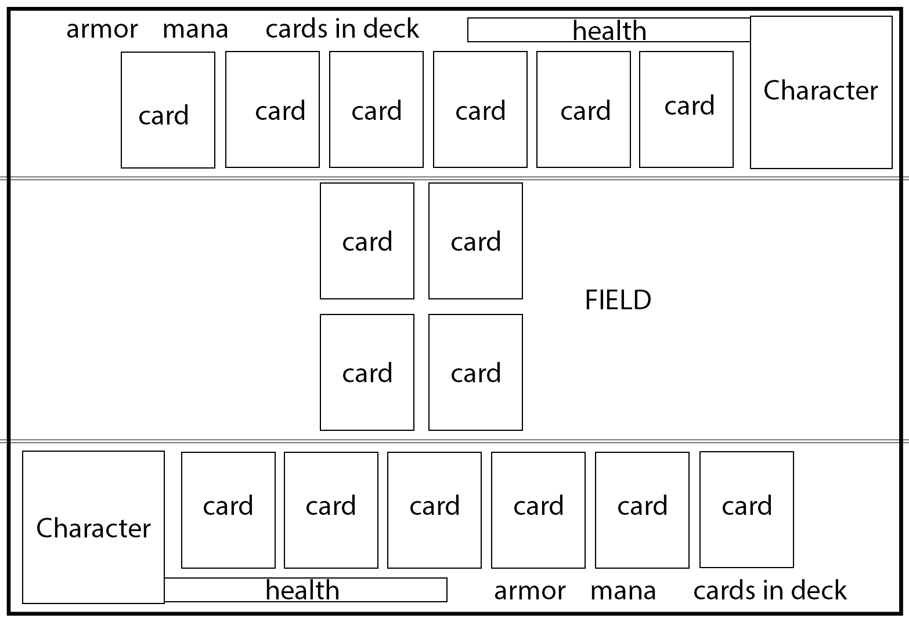

Hearthstone (WILL FINISH BETA TOMORROW)
=======

**author:** Laurens Verspeek - 10184465 
            laurens_verspeek@hotmail.com

**course:** Native App Studios - Univeristy of Amsterdam

_This app will be a real-time multiplayer game application for Android based on games like Heartstone (http://eu.battle.net/hearthstone/en/)_

###Features###
- (real-time) Multiplayer support
- Different type of cards (attack-card, defense-card, health-card, spell-card etc.)
- Changable deck of cards
- Users get random cards from the deck
- Users can play those cards (against another user)
- Option to start a new game or to resign etc.
- A ranking system for the users. 

###Technologies###
- Android SDK (java)
- AndEngine (2d opengl game rendering engine)
- AndEgnine Multiplayer Extension

###Mockups###

