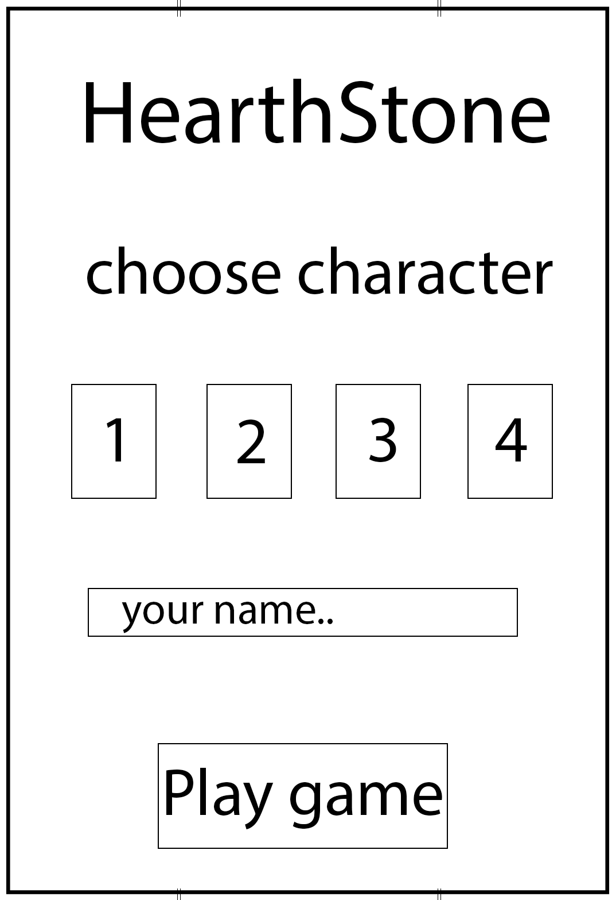
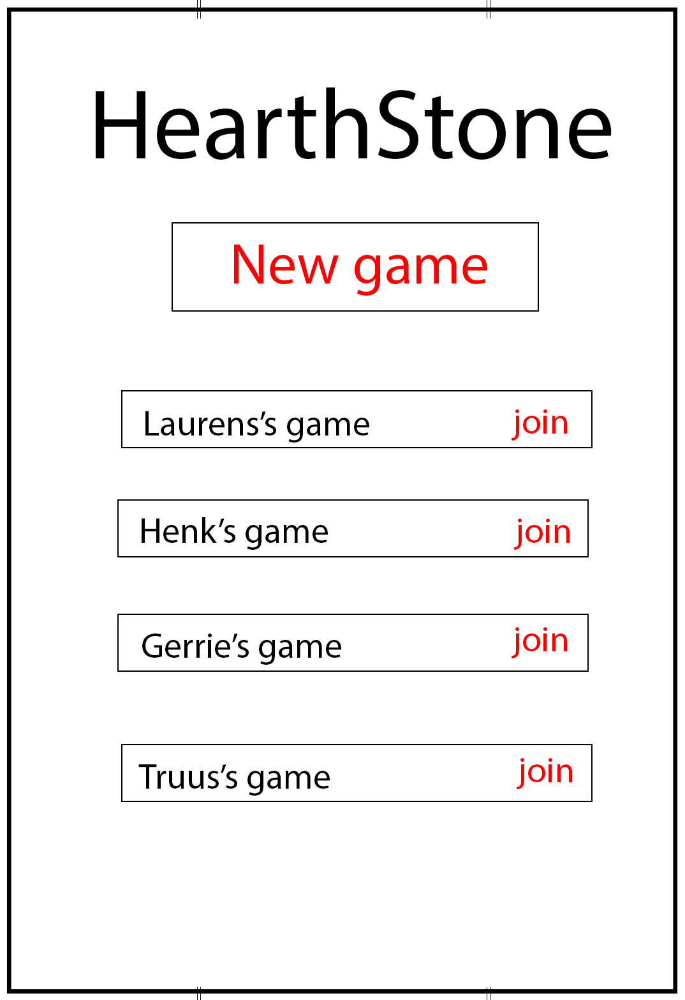
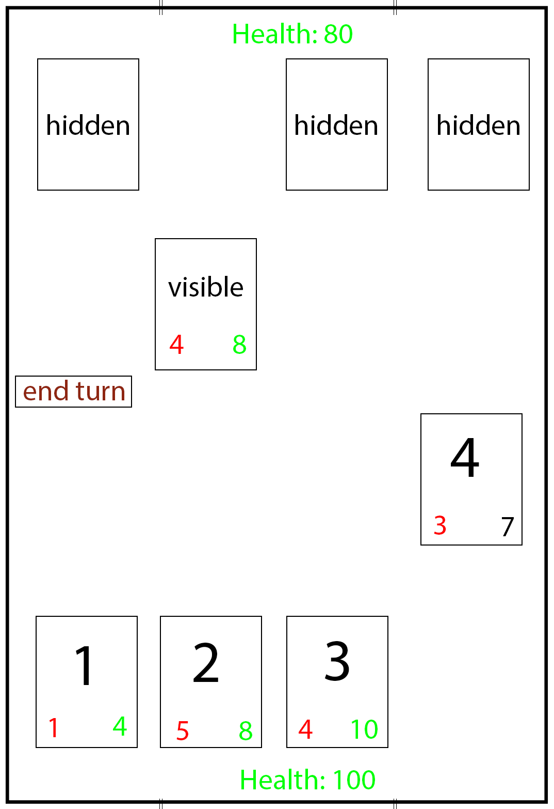
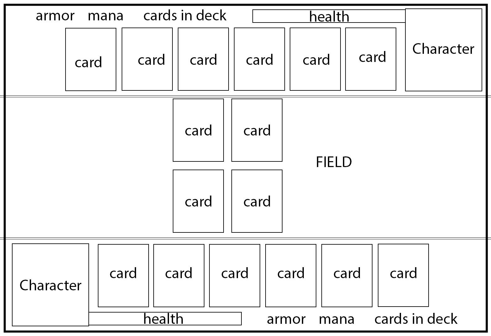

Design Document
===============

## Classes and methods
Cards class (which holds all the information about the deck of cards)

User class (which holds all the information about the current user)

Utils class (methods which will be used a lot over the different activities)

Mainactivity

&nbsp;- init&nbsp;

&nbsp;- onCharacterClicked (choose a character)

&nbsp;- onPlayGameClicked (make connection with the warpapp server)

&nbsp;- onConnect (go to GameListActivity)

GameListActivity

&nbsp;- joinRoom (join a game)

&nbsp;- goToGameScreen (go to GameActivity)

&nbsp;- onJoinRoomDone (call goToGameScreen)

&nbsp;- onGetMatchedRoomsDone (make list of open games)

&nbsp;- onJoinNewRoomClicked (create a new game)&nbsp;

&nbsp;- onCreateRoomDone (join newly created game)

GameActivity

&nbsp;- newSprite (create new sprite)

&nbsp;- onCreateEngineOptions (create andengine)

&nbsp;- onCreateResources (create resources for engine)

&nbsp;- onCreateScene (create the scene)

&nbsp;- initObjects (initialize all sprites)

&nbsp;- pickRandomCard (pick a random card from your deck)

&nbsp;- addMorePlayer (handle a new player joining the game)

&nbsp;- sendUpdateEvent (send event to other player)

&nbsp;- handleLeave (handle players leaving)

&nbsp;- onSceneTouchEvent (handle the touch events of the users)

&nbsp;- playObject (play a card)

&nbsp;- updateMove (update your position)

EventHandler (handle room events and communication)

&nbsp;- onChatReceived (handle a received event)

&nbsp;- onUserChangeRoomProperty (handle a change of properties from other user)

&nbsp;- onUserJoinedRoom (handle new users)

&nbsp;- onUserLeftRoom (handle leaving users)

&nbsp;- onGetLiveRoomInfoDone (get properties of room and handle them)

## Implementation details

I will be using a server which has an API and is hosted and by AppWarp for the
communication and the multiplayer part of the game.

For the game itself I will use AndEngine&nbsp;(2\. opengl game rendering engine)

# Mockups

## Extension

# Java Programming Style Guide

## 1. Formatting

### 1.1 Indentation

**All indenting is done with spaces, not tabs. All indents are four spaces.**

_Reasoning: All programs work well with spaces. Most programs will mix tabs and spaces so that some lines are indented with spaces and some with tabs. If your tabbing is set to 4 and you share a file with someone that has tabbing set to 8, everything comes out goofy._

**Closing matching braces always line up vertically in the same column as their construct. Opening matchin braces follow directly after their construct with one space in between**
  
example:

    void foo() {
        while (bar &gt; 0) {
            System.out.println();
            bar--;
        }

        if (oatmeal == tasty) {
            System.out.println("this styling guide");
        } else if (oatmeal == yak) {
            System.out.println("made by");
        } else {
            System.out.println("Laurens Verspeek");
        }

        switch (suckFactor) {
            case 1:
                System.out.println("My hangman app");
                break;
            case 2:
                System.out.println("is going to be");
                break;
            case 3:
                System.out.println("really ");
                break;
            default:
                System.out.println("awesome");
                break;
        }
    }

**All if, while and for statements must use braces even if they control just one statement.**

_Reasoning: Consistency is easier to read. Plus, less editing is involved if lines of code are added or removed._

        if (superHero == theTick) System.out.println("Spoon!");  // NO!

        if (superHero == theTick)
            System.out.println("Spoon!");  // NO!

        if (superHero == theTick) {
            System.out.println("Spoon!");
        }                                            // YES!

### 1.2 - Spacing

**All method names should be immediately followed by a left parenthesis. **

        foo (i, j); // NO!
        foo(i, j);  // YES!

**All array dereferences should be immediately followed by a left square bracket.**

        args [0];  // NO!
        args[0];   // YES!

**Binary operators should have a space on either side.**

        a=b*c;          // NO!
        a = b*c;        // NO!
        a=b * c;        // NO!
        a = b * c;      // YES!

**Unary operators should be immediately preceded or followed by their operand.**

        count ++; // NO!
        count++;  // YES!

        i --;     // NO!
        i--;      // YES!

**Commas and semicolons are always followed by whitespace.**

         for (int i = 0;i < 10;i++); //NO!
         for (int i = 0; i < 10; i++); //YES!
         
         foo(i,j); //NO!
         foo(i, j); //YES!

**All casts should be written with no spaces. **

        (MyClass) v.get(3);  // NO!
        ( MyClass )v.get(3); // NO!
        (MyClass)v.get(3);   // YES!

**The keywords `if`, `while`, `for`, `switch`, and `catch` must be followed by a space.**

         if(hungry)  // NO!
         if (hungry) // YES!

### 1.3 - Class Member Ordering

        class Order {
            // fields (attributes)

            // constructors

            // methods
        }

### 1.4 - Maximum Line Length

**Avoid making lines longer than 120 characters. If your code starts to get indented way to the right, consider breaking your code into more methods.**

_Reasoning: Editors and printing facilities used by most programmers can easily handle 120 characters. Longer lines can be frustrating to work with._

### 1.5 - Parentheses

**Parentheses should be used in expressions not only to specify order of precedence, but also to help simplify the expression. When in doubt, parenthesize.**

## 2 - Identifiers

### 2.1 - Classes and Interfaces

**All class and interface identifiers will use mixed case. The first letter of each word in the name will be uppercase, including the first letter of the name. All other letters will be in lowercase, except in the case of an acronym, which will be all upper case.**

### 2.2 - Packages

**Package names will use lower case characters only.

### 2.3 - All Other Identifiers

**All other identifiers, including (but not limited to) fields, local variables, methods and parameters, will use the following naming convention. This includes identifiers for constants.**

General naming conventions:

- Names representing types must be nouns and written in mixed case starting with upper case.
- Variable names must be in mixed case starting with lower case.
- Names of Final variables must be all uppercase using underscore to separate words.
- Names representing methods must be verbs and written in mixed case starting with lower case.
- Do not use underscores to indicate class variables.
- All names should be written in English.

Example:

        public class Person {
            private String FirstName; // NO! (Start with uppercase)
            private String firstName;  // YES!

            private String _lastName;  // NO! (Scope identification: _ for member variable)
            private String lastName;   // YES!

            // ...
        }

## 3 - Coding

### 3.1 - Constructs to Avoid

#### 3.1.1 - Never use do..while

**Do not use `do..while` loops.**

_Reasoning: Consider that the programmer looking at your code is probably examining each method starting at the top and working down. When encountering a loop, the first thing the programmer wants to know is what terminates the loop. If you have that logic at the bottom, it is harder to read. Further, many less experienced programmers are not familiar with do..while, but may be required to modify your code._

So rather than:

        boolean done = false;
        do {
            ...
        } while (!done)

use:

        boolean done = false;
        while (!done) {
           ...
        }

#### 3.1.2 - Never use `continue`

**Never use `continue`.**

_Reasoning: Using `continue` makes it difficult to later break the construct into smaller constructs or methods. It also forces the developer to consider more than one end point for a construct._

### 3.2 - Initialization

**Declare variables as close as possible to where they are used.**

Examples:

        int totalWide;
        int firstWide = 20;
        int secondWide = 12;
        firstWide = doFoo(firstWide, secondWide);
        doBar(firstWide, secondWide);
        totalWide = firstWide %2B secondWide;         //  wrong!

        int firstWide = 20;
        int secondWide = 12;
        firstWide = doFoo(firstWide, secondWide);
        doBar(firstWide, secondWide);
        int totalWide = firstWide %2B secondWide;     //  right!

        int secondWide = 12;
        int firstWide = doFoo(20, secondWide);
        doBar(firstWide, secondWide);
        int totalWide = firstWide %2B secondWide;     //  even better!

## 4 - Commenting

    _"Any fool can write code that a computer can understand.
    Good programmers write code that humans can understand."
    _

    --- Martin Fowler, Refactoring: Improving the Design of Existing Code
    
_Try to explain what a block of code does. Try not to comment too much, but also not too little. You have to find a good balance._

**All methods/functions should be commented with:**

- a _brief_ description of what the method does
- a description of each parameter value
- a description of its return values

Within functions, use inline comments and keep them short (e.g., one line.. Don't forget to leave one space between the // and your comments first character

Example:

    /*
     * method convertFtoC takes a float which is in Fahrenheit and returns
     * a float which has the same degrees as the input float, only coverted 
     * in Celcius.
     */
    int convertFtoC(float fahrenheit) {
        float celsius = 5.0 / 9.0 * (fahrenheit - 32.0); // convert Fahrenheit to Celsius
        
        return celsius;
    }

